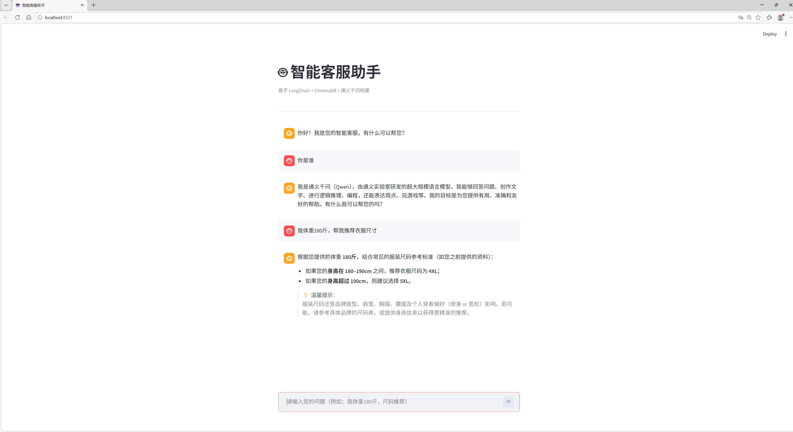
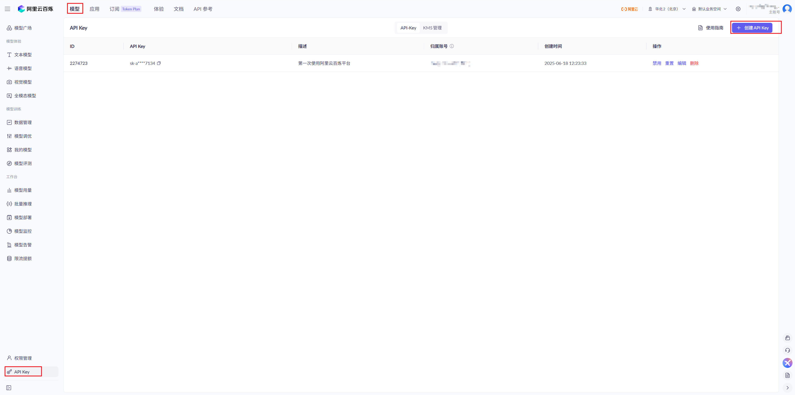
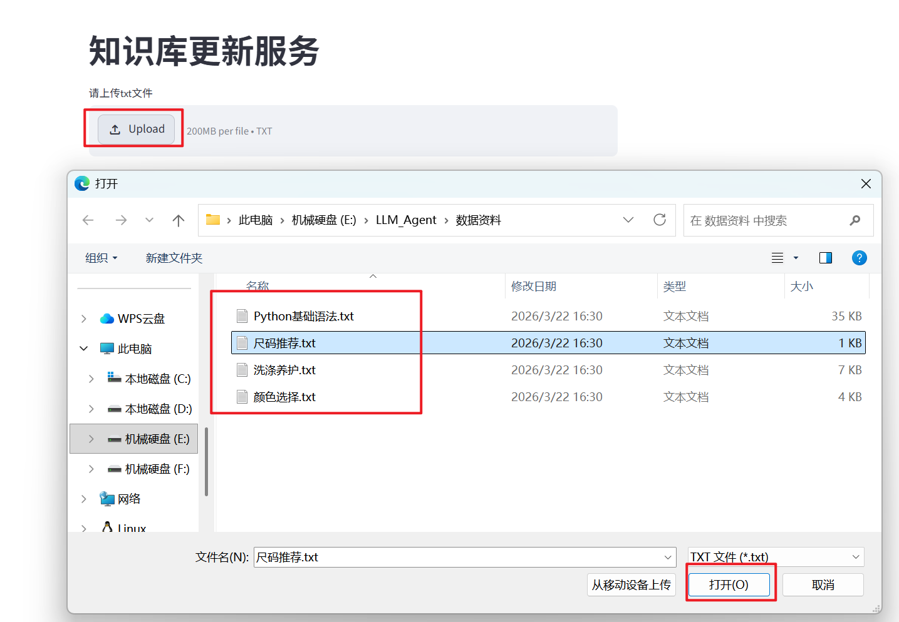

# 智能客服小助手
- 技术栈：LangChain框架 + Chroma向量数据库 + Streamlit可视化 + 阿里云百炼云平台大模型

# 1. 环境配置
## 1.1 创建虚拟环境
### 方式一：Conda创建
1. 通过conda创建python3.11环境
```bash
conda create -n <项目环境名称> python=3.11
```
2. 激活环境
```bash
conda activate <项目环境名称>
```

### 方式二：原生Python创建
1. 下载Python解释器，确保系统里的Python解释器版本>=3.10
```cmd
# 检查python版本
python --version
```
2. 创建虚拟环境
```
python -m venv <项目环境名称>
```
3. 激活虚拟环境
```
<项目环境名称>\Scripts\activate
```
## 1.2 拉取项目
```bash
git clone https://github.com/gaotianci99/IntelligentCustomerService.git
```
## 1.3 安装项目依赖

```bash
# 进入项目根目录
cd IntelligentCustomerService
# 安装项目依赖
pip install -r requirements.txt
```
## 1.4 配置环境变啦DASH_SCOPE_KEY
阿里云百炼控制台找到API_KEY：https://bailian.console.aliyun.com/cn-beijing?tab=model#/api-key

```bash
# Widnows命令提示符下配置
setx DASHSCOPE_API_KEY "your_aliyun-bailian_api_key"
```

# 2. 运行项目
## 2.1 拷贝项目到本地
```bash
# 进入项目根目录
cd IntelligentCustomerService
```

## 2.2 将知识库添加到向量数据库
```
streamlit run .\app_file_uploader.py
```
运行成功后，会生成一个url地址:http://localhost:8501, 浏览器访问该url：

> 注意：添加完知识库后，这个服务可以关闭

## 2.3 开始智能客服前端
```bash
streamlit run .\app_qa.py 
```
生成一个url并访问: http://localhost:8501
